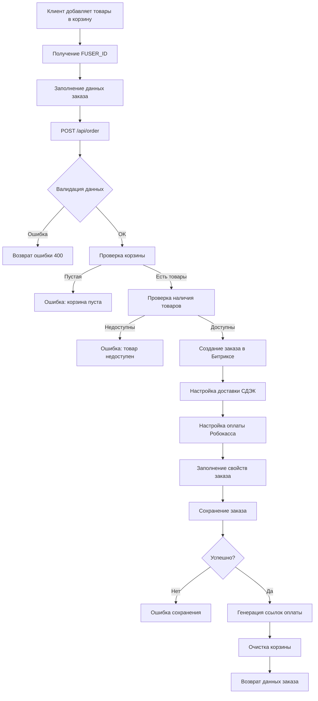

# 📦 API Заказов - Полная документация

## 🎯 Обзор

REST API для создания и управления заказами в интернет-магазине на базе 1С Битрикс. Система поддерживает создание заказов из пользовательской корзины, интеграцию с СДЭК для доставки и Робокассой для оплаты.

### Основные возможности:
- ✅ Создание заказов из корзины пользователя (FUSER_ID)
- ✅ Автоматическая обработка оплаты через Робокассу
- ✅ Интеграция с ПВЗ СДЭК
- ✅ Поддержка анонимных пользователей
- ✅ Автоматическая очистка корзины после заказа
- ✅ Генерация прямых ссылок на оплату
- ✅ Полное логирование операций

---

## 🚀 Быстрый старт

### 1. Создание заказа (минимальный пример)

```bash
POST /api/order
Content-Type: application/json

{
    "fuser_id": "121124526",
    "customer_name": "Иван",
    "customer_lastname": "Иванов",
    "customer_phone": "+79123456789",
    "customer_email": "ivan@example.com",
    "cdek_code": "MSK2339",
    "delivery_address": "Москва, ул. Большая Новодмитровская, 23"
}
```

### 2. Ответ при успешном создании

```json
{
    "success": true,
    "data": {
        "order_id": 123,
        "order_number": "00000123",
        "total_price": 15990,
        "currency": "RUB",
        "status": "created",
        "payment_required": true,
        "items_count": 3,
        "basket_cleared": true,
        "payment_url": "https://shop4shoot.com/cart/?order_id=123",
        "direct_payment_url": "https://auth.robokassa.ru/Merchant/Index.aspx?MerchantLogin=shop4shoot&OutSum=15990&..."
    },
    "message": "Заказ успешно создан из корзины"
}
```

---

## 📋 API Endpoints

### POST /api/order - Создание заказа

Создает новый заказ на основе товаров в корзине пользователя.

#### Параметры запроса

| Параметр | Тип | Обязательный | Описание |
|----------|-----|--------------|----------|
| `fuser_id` | integer | ✅ Да | ID корзины пользователя (FUSER_ID) |
| `customer_name` | string | ✅ Да | Имя покупателя |
| `customer_lastname` | string | ✅ Да | Фамилия покупателя |
| `customer_middlename` | string | ❌ Нет | Отчество покупателя |
| `customer_phone` | string | ✅ Да | Телефон покупателя |
| `customer_email` | string | ✅ Да | Email покупателя |
| `cdek_code` | string | ✅ Да | Код ПВЗ СДЭК (например: MSK2339) |
| `delivery_address` | string | ✅ Да | Полный адрес ПВЗ СДЭК |
| `payment_system_id` | integer | ❌ Нет | ID способа оплаты (по умолчанию: 3 - Робокасса) |
| `comment` | string | ❌ Нет | Комментарий к заказу |
| `clear_basket` | string | ❌ Нет | Очистить корзину после заказа (Y/N, по умолчанию: Y) |

#### Примеры запросов

**Полный запрос:**
```json
{
    "fuser_id": "121124526",
    "customer_name": "Иван",
    "customer_lastname": "Иванов",
    "customer_middlename": "Иванович",
    "customer_phone": "+79123456789",
    "customer_email": "ivan@example.com",
    "cdek_code": "MSK2339",
    "delivery_address": "Москва, ул. Большая Новодмитровская, 23",
    "payment_system_id": 3,
    "comment": "Доставить после 18:00",
    "clear_basket": "Y"
}
```

**Минимальный запрос:**
```json
{
    "fuser_id": "121124526",
    "customer_name": "Иван",
    "customer_lastname": "Иванов",
    "customer_phone": "+79123456789",
    "customer_email": "ivan@example.com",
    "cdek_code": "MSK2339",
    "delivery_address": "Москва, ул. Большая Новодмитровская, 23"
}
```

#### Ответы

**Успешное создание (201):**
```json
{
    "success": true,
    "data": {
        "order_id": 123,
        "order_number": "00000123",
        "total_price": 15990,
        "currency": "RUB",
        "status": "created",
        "payment_required": true,
        "items_count": 3,
        "basket_cleared": true,
        "payment_url": "https://shop4shoot.com/cart/?order_id=123",
        "direct_payment_url": "https://auth.robokassa.ru/Merchant/Index.aspx?..."
    },
    "message": "Заказ успешно создан из корзины",
    "debug_log": [...]
}
```

**Ошибки валидации (400):**
```json
{
    "success": false,
    "error": {
        "code": 400,
        "message": "Корзина пользователя пуста"
    },
    "debug_log": [...]
}
```

### GET /api/order - Получение информации о заказе

Получение статуса заказа или формы оплаты.

#### Параметры запроса

| Параметр | Тип | Обязательный | Описание |
|----------|-----|--------------|----------|
| `action` | string | ❌ Нет | Тип операции: `get_status` (по умолчанию) или `get_payment_form` |
| `order_id` | integer | ✅ Да | ID заказа |

#### Примеры использования

**Получение статуса заказа:**
```bash
GET /api/order?action=get_status&order_id=123
```

**Ответ:**
```json
{
    "success": true,
    "data": {
        "order_id": 123,
        "order_number": "00000123",
        "status": "new",
        "total_price": 15990,
        "paid_sum": 0,
        "currency": "RUB",
        "is_paid": false,
        "is_canceled": false,
        "is_shipped": false,
        "date_created": "2024-01-15 14:30:00"
    }
}
```

**Получение формы оплаты:**
```bash
GET /api/order?action=get_payment_form&order_id=123
```

**Ответ:**
```json
{
    "success": true,
    "data": {
        "order_id": 123,
        "payment_id": 456,
        "payment_system": "Банковская карта",
        "amount": 15990,
        "currency": "RUB",
        "payment_form": "<form>...</form>"
    }
}
```

---

## 🔧 Интеграции

### 🛒 Работа с корзиной

API заказов полностью интегрирован с существующей системой корзины через FUSER_ID:

```javascript
// 1. Добавляем товары в корзину
await fetch('/api/basket', {
    method: 'POST',
    headers: { 'Content-Type': 'application/json' },
    body: JSON.stringify({
        fuser_id: fuserId,
        product_id: 123,
        quantity: 2
    })
});

// 2. Создаем заказ из корзины
const orderData = {
    fuser_id: fuserId,
    customer_name: "Иван",
    customer_lastname: "Иванов",
    customer_phone: "+79123456789",
    customer_email: "ivan@example.com",
    cdek_code: "MSK2339",
    delivery_address: "Москва, ул. Большая Новодмитровская, 23"
};

const response = await fetch('/api/order', {
    method: 'POST',
    headers: { 'Content-Type': 'application/json' },
    body: JSON.stringify(orderData)
});
```

### 🚚 Интеграция с СДЭК

Система поддерживает доставку через пункты выдачи СДЭК:

```json
{
    "cdek_code": "MSK2339",
    "delivery_address": "Москва, ул. Большая Новодмитровская, 23, Москва"
}
```

**Поддерживаемые форматы кодов ПВЗ:**
- `MSK2339` - Москва
- `SPB1234` - Санкт-Петербург
- `EKB5678` - Екатеринбург
- И другие коды согласно справочнику СДЭК

### 💳 Интеграция с Робокассой

Система автоматически генерирует ссылки для оплаты через Робокассу:

**Возвращаемые ссылки:**
1. `payment_url` - ссылка на ваш фронтенд для информирования пользователя
2. `direct_payment_url` - прямая ссылка в Робокассу для мгновенной оплаты

**Пример прямой ссылки:**
```
https://auth.robokassa.ru/Merchant/Index.aspx?
MerchantLogin=shop4shoot&
OutSum=15990&
InvId=456&
Description=Оплата заказа №00000123&
SignatureValue=abc123...&
Receipt=...&
SHP_BX_PAYSYSTEM_CODE=3
```

---

## 📊 Статусы заказов

| Статус | Описание | is_paid | is_canceled | is_shipped |
|--------|----------|---------|-------------|------------|
| `new` | Новый заказ | false | false | false |
| `paid` | Оплачен | true | false | false |
| `shipped` | Отправлен | true | false | true |
| `canceled` | Отменен | false | true | false |

## 🛡️ Обработка ошибок

### Коды ошибок

| Код | Описание | Примеры |
|-----|----------|---------|
| 400 | Ошибка валидации | Пустая корзина, неверные параметры |
| 404 | Не найдено | Заказ не существует |
| 500 | Внутренняя ошибка | Ошибка сохранения в БД |

### Примеры ошибок

**Пустая корзина:**
```json
{
    "success": false,
    "error": {
        "code": 400,
        "message": "Корзина пользователя пуста"
    }
}
```

**Недоступный товар:**
```json
{
    "success": false,
    "error": {
        "code": 400,
        "message": "Товар \"iPhone 15 Pro\" недоступен: Недостаточно товара на складе"
    }
}
```

**Неверный FUSER_ID:**
```json
{
    "success": false,
    "error": {
        "code": 400,
        "message": "FUSER_ID обязателен для создания заказа"
    }
}
```

---

## 💡 Примеры использования

### React/JavaScript Frontend

```javascript
import { useState } from 'react';

function OrderCreation({ fuserId }) {
    const [orderData, setOrderData] = useState({
        fuser_id: fuserId,
        customer_name: '',
        customer_lastname: '',
        customer_phone: '',
        customer_email: '',
        cdek_code: '',
        delivery_address: '',
        comment: ''
    });

    const createOrder = async () => {
        try {
            const response = await fetch('/api/order', {
                method: 'POST',
                headers: { 'Content-Type': 'application/json' },
                body: JSON.stringify(orderData)
            });

            const result = await response.json();

            if (result.success) {
                // Показываем успешное создание
                alert(`Заказ №${result.data.order_number} создан!`);
                
                // Редиректим на оплату
                window.location.href = result.data.payment_url;
            } else {
                alert(`Ошибка: ${result.error.message}`);
            }
        } catch (error) {
            alert(`Ошибка запроса: ${error.message}`);
        }
    };

    return (
        <form onSubmit={(e) => { e.preventDefault(); createOrder(); }}>
            <input 
                placeholder="Имя"
                value={orderData.customer_name}
                onChange={(e) => setOrderData({...orderData, customer_name: e.target.value})}
                required
            />
            <input 
                placeholder="Фамилия"
                value={orderData.customer_lastname}
                onChange={(e) => setOrderData({...orderData, customer_lastname: e.target.value})}
                required
            />
            <input 
                placeholder="Телефон"
                value={orderData.customer_phone}
                onChange={(e) => setOrderData({...orderData, customer_phone: e.target.value})}
                required
            />
            <input 
                placeholder="Email"
                type="email"
                value={orderData.customer_email}
                onChange={(e) => setOrderData({...orderData, customer_email: e.target.value})}
                required
            />
            <input 
                placeholder="Код ПВЗ СДЭК"
                value={orderData.cdek_code}
                onChange={(e) => setOrderData({...orderData, cdek_code: e.target.value})}
                required
            />
            <textarea
                placeholder="Адрес ПВЗ"
                value={orderData.delivery_address}
                onChange={(e) => setOrderData({...orderData, delivery_address: e.target.value})}
                required
            />
            <textarea
                placeholder="Комментарий (необязательно)"
                value={orderData.comment}
                onChange={(e) => setOrderData({...orderData, comment: e.target.value})}
            />
            <button type="submit">Создать заказ</button>
        </form>
    );
}
```

### cURL примеры

**Создание заказа:**
```bash
curl -X POST https://shop4shoot.com/api/order \
  -H "Content-Type: application/json" \
  -d '{
    "fuser_id": "121124526",
    "customer_name": "Иван",
    "customer_lastname": "Иванов",
    "customer_phone": "+79123456789",
    "customer_email": "ivan@example.com",
    "cdek_code": "MSK2339",
    "delivery_address": "Москва, ул. Большая Новодмитровская, 23",
    "comment": "Доставить после 18:00"
  }'
```

**Получение статуса:**
```bash
curl -X GET "https://shop4shoot.com/api/order?action=get_status&order_id=123"
```

**Получение формы оплаты:**
```bash
curl -X GET "https://shop4shoot.com/api/order?action=get_payment_form&order_id=123"
```

### Python

```python
import requests
import json

class OrderAPI:
    def __init__(self, base_url="https://shop4shoot.com"):
        self.base_url = base_url
    
    def create_order(self, fuser_id, customer_data, delivery_data, comment=""):
        url = f"{self.base_url}/api/order"
        
        payload = {
            "fuser_id": fuser_id,
            "customer_name": customer_data["name"],
            "customer_lastname": customer_data["lastname"],
            "customer_phone": customer_data["phone"],
            "customer_email": customer_data["email"],
            "cdek_code": delivery_data["code"],
            "delivery_address": delivery_data["address"],
            "comment": comment
        }
        
        response = requests.post(url, json=payload)
        return response.json()
    
    def get_order_status(self, order_id):
        url = f"{self.base_url}/api/order"
        params = {"action": "get_status", "order_id": order_id}
        
        response = requests.get(url, params=params)
        return response.json()

# Использование
api = OrderAPI()

customer = {
    "name": "Иван",
    "lastname": "Иванов",
    "phone": "+79123456789",
    "email": "ivan@example.com"
}

delivery = {
    "code": "MSK2339",
    "address": "Москва, ул. Большая Новодмитровская, 23"
}

result = api.create_order("121124526", customer, delivery, "Доставить после 18:00")
print(f"Заказ создан: {result}")
```

### PHP

```php
<?php

class OrderAPI 
{
    private $baseUrl;
    
    public function __construct($baseUrl = "https://shop4shoot.com") 
    {
        $this->baseUrl = $baseUrl;
    }
    
    public function createOrder($fuserId, $customerData, $deliveryData, $comment = "") 
    {
        $url = $this->baseUrl . "/api/order";
        
        $payload = [
            "fuser_id" => $fuserId,
            "customer_name" => $customerData["name"],
            "customer_lastname" => $customerData["lastname"],
            "customer_phone" => $customerData["phone"],
            "customer_email" => $customerData["email"],
            "cdek_code" => $deliveryData["code"],
            "delivery_address" => $deliveryData["address"],
            "comment" => $comment
        ];
        
        $ch = curl_init();
        curl_setopt($ch, CURLOPT_URL, $url);
        curl_setopt($ch, CURLOPT_POST, true);
        curl_setopt($ch, CURLOPT_POSTFIELDS, json_encode($payload));
        curl_setopt($ch, CURLOPT_HTTPHEADER, ['Content-Type: application/json']);
        curl_setopt($ch, CURLOPT_RETURNTRANSFER, true);
        
        $response = curl_exec($ch);
        curl_close($ch);
        
        return json_decode($response, true);
    }
    
    public function getOrderStatus($orderId) 
    {
        $url = $this->baseUrl . "/api/order?action=get_status&order_id=" . $orderId;
        
        $response = file_get_contents($url);
        return json_decode($response, true);
    }
}

// Использование
$api = new OrderAPI();

$customer = [
    "name" => "Иван",
    "lastname" => "Иванов",
    "phone" => "+79123456789",
    "email" => "ivan@example.com"
];

$delivery = [
    "code" => "MSK2339",
    "address" => "Москва, ул. Большая Новодмитровская, 23"
];

$result = $api->createOrder("121124526", $customer, $delivery, "Доставить после 18:00");
echo "Заказ создан: " . print_r($result, true);
?>
```

---

## 🔄 Workflow создания заказа



---

## 🎛️ Настройка и конфигурация

### Переменные окружения

```bash
# Робокасса
ROBOKASSA_LOGIN=shop4shoot
ROBOKASSA_PASSWORD=password123
ROBOKASSA_TEST_PASSWORD=test_password123
ROBOKASSA_IS_TEST=N

# СДЭК
CDEK_DELIVERY_SERVICE_ID=1

# Битрикс
BITRIX_PERSON_TYPE_ID=1
BITRIX_DEFAULT_USER_ID=1
```

### Настройка в админке Битрикса

1. **Платежная система Робокасса (ID: 3)**
   - Логин магазина
   - Пароль 1 (для формирования подписи)
   - Пароль 2 (для проверки уведомлений)
   - Тестовый режим

2. **Служба доставки СДЭК**
   - Настройка API ключей
   - Конфигурация пунктов выдачи

3. **Типы плательщиков**
   - Физическое лицо (ID: 1)
   - Настройка свойств заказа

### Требования к системе

- **PHP**: 8.1+
- **1С Битрикс**: Управление сайтом 22.0+
- **Модули Битрикса**: sale, catalog, currency
- **База данных**: MySQL 5.7+ / MariaDB 10.3+

---

## 🔍 Отладка и мониторинг

### Debug Log

Каждый запрос содержит детальный лог операций:

```json
{
    "debug_log": [
        {
            "time": "2024-01-15 14:30:01",
            "message": "POST request received",
            "data": {
                "fuser_id": "121124526",
                "customer_name": "Иван"
            }
        },
        {
            "time": "2024-01-15 14:30:02",
            "message": "Using FUSER_ID from request",
            "data": {
                "fuser_id": "121124526"
            }
        },
        {
            "time": "2024-01-15 14:30:03",
            "message": "Loaded basket items",
            "data": {
                "count": 3,
                "items": [...]
            }
        }
    ]
}
```

### Логирование ошибок

Все ошибки записываются в лог сервера:
```
[2024-01-15 14:30:00] Orders API Error: Cannot create order: User ID missing in /path/to/ordernew.php:123
```

### Мониторинг производительности

Добавьте отслеживание времени выполнения:

```javascript
const startTime = performance.now();

const response = await fetch('/api/order', {
    method: 'POST',
    body: JSON.stringify(orderData)
});

const endTime = performance.now();
console.log(`Создание заказа заняло ${endTime - startTime} миллисекунд`);
```

---

## 🚀 Расширенные возможности

### Webhook уведомления

Можно настроить webhook для уведомления о создании заказов:

```php
// В обработчике после создания заказа
private function sendWebhook($orderData) {
    $webhookUrl = "https://your-system.com/webhook/order-created";
    
    $payload = [
        'event' => 'order.created',
        'order_id' => $orderData['order_id'],
        'timestamp' => time()
    ];
    
    // Отправка POST запроса
    $ch = curl_init($webhookUrl);
    curl_setopt($ch, CURLOPT_POST, true);
    curl_setopt($ch, CURLOPT_POSTFIELDS, json_encode($payload));
    curl_setopt($ch, CURLOPT_HTTPHEADER, ['Content-Type: application/json']);
    curl_exec($ch);
    curl_close($ch);
}
```

### Кэширование

Для повышения производительности можно добавить кэширование:

```php
private function getCachedDeliveryServices() {
    $cache = \Bitrix\Main\Data\Cache::createInstance();
    $cacheKey = 'delivery_services';
    
    if ($cache->initCache(3600, $cacheKey, '/orders/')) {
        return $cache->getVars()['services'];
    }
    
    $services = Delivery\Services\Manager::getActiveList();
    
    $cache->startDataCache();
    $cache->endDataCache(['services' => $services]);
    
    return $services;
}
```

### Валидация с помощью JSON Schema

```json
{
    "$schema": "http://json-schema.org/draft-07/schema#",
    "type": "object",
    "properties": {
        "fuser_id": {
            "type": "string",
            "pattern": "^[0-9]+$"
        },
        "customer_name": {
            "type": "string",
            "minLength": 2,
            "maxLength": 50
        },
        "customer_phone": {
            "type": "string",
            "pattern": "^\\+?[78][0-9]{10}$"
        },
        "customer_email": {
            "type": "string",
            "format": "email"
        }
    },
    "required": ["fuser_id", "customer_name", "customer_lastname", "customer_phone", "customer_email", "cdek_code", "delivery_address"]
}
```

---

## ❓ FAQ

### Вопрос: Что делать если корзина пуста?

**Ответ:** API вернет ошибку 400 с сообщением "Корзина пользователя пуста". Сначала добавьте товары в корзину через `/api/basket`.

### Вопрос: Можно ли создать заказ без FUSER_ID?

**Ответ:** Нет, FUSER_ID обязателен, так как он используется для получения товаров из корзины пользователя.

### Вопрос: Поддерживается ли другие способы оплаты кроме Робокассы?

**Ответ:** Да, можно передать любой `payment_system_id` из настроенных в Битриксе. По умолчанию используется ID=3 (Робокасса).

### Вопрос: Что происходит с корзиной после создания заказа?

**Ответ:** По умолчанию корзина очищается (`clear_basket: "Y"`). Можно отключить очистку передав `clear_basket: "N"`.

### Вопрос: Как обрабатываются недоступные товары?

**Ответ:** Перед созданием заказа проверяется наличие всех товаров на складе. Если хотя бы один товар недоступен, заказ не создается.

### Вопрос: Можно ли изменить заказ после создания?

**Ответ:** Через данный API нет, но можно использовать стандартный API Битрикса или админку для изменения заказов.

---

## 📞 Поддержка

**Email**: support@shop4shoot.com  
**Документация**: https://shop4shoot.com/docs/  
**API Base URL**: https://shop4shoot.com/api/

---

*Документация обновлена: 2024-01-15*  
*Версия API: 1.0* 