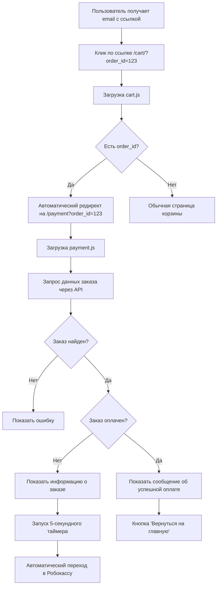

# 💳 Поток оплаты заказов - Документация

## 🎯 Обзор

Система обработки оплаты заказов в Shop4Shoot поддерживает автоматическое перенаправление пользователей на страницу оплаты по ссылкам из email-уведомлений и обеспечивает плавный UX при переходе к Робокассе.

### Основные компоненты:
- 📧 **Email-ссылки** - ссылки вида `/cart/?order_id=123`
- 🔄 **Автоматическое перенаправление** - с корзины на страницу оплаты
- 💰 **Страница оплаты** - `/payment?order_id=123`
- 🏦 **Интеграция с Робокассой** - прямые ссылки и формы оплаты

---

## 🚀 Архитектура системы

### 1. Структура URL

```
Email link:       https://shop4shoot.com/cart/?order_id=318
                         ↓ (автоматический редирект)
Payment page:     https://shop4shoot.com/payment?order_id=318
                         ↓ (через 5 сек или по клику)
Robokassa:        https://auth.robokassa.ru/Merchant/Index.aspx?...
```

### 2. Файловая структура

```
frontend/src/pages/
├── cart.js              # Обработка email-ссылок + редирект
├── payment.js           # Основная страница оплаты
└── test-payment.js      # Страница для тестирования

frontend/src/lib/api/
└── bitrix.js           # API функции для заказов
```

---

## 📋 Компоненты системы

### 1. Обработка в cart.js

```javascript
// Проверка параметра order_id и редирект
const { order_id } = router.query;

useEffect(() => {
  if (router.isReady && order_id) {
    // Перенаправляем на страницу оплаты
    router.push(`/payment?order_id=${order_id}`);
    return;
  }
}, [router.isReady, order_id]);
```

**Функциональность:**
- ✅ Обнаруживает параметр `order_id` в URL
- ✅ Автоматически перенаправляет на `/payment?order_id=XXX`
- ✅ Сохраняет совместимость с существующей корзиной

### 2. Страница оплаты (payment.js)

**Ключевые возможности:**
- 📊 Отображение информации о заказе
- 🎨 Красивый UI с анимациями
- ⏱️ Автоматическое перенаправление через 5 секунд
- 🔄 Обработка разных статусов заказа
- 🛡️ Обработка ошибок

**Компоненты интерфейса:**
```javascript
// Основная карточка заказа
<PaymentCard>
  <OrderInfo>           // Информация о заказе
  <StatusBadge>         // Цветной бадж статуса
  <PaymentButton>       // Кнопка оплаты
  <CountdownText>       // Счетчик обратного отсчета
</PaymentCard>
```

### 3. API функции (bitrix.js)

```javascript
// Получение статуса заказа
export const getOrderStatus = async (orderId) => {
  const response = await bitrixApi.get('/order', { 
    params: { action: 'get_status', order_id: orderId } 
  });
  return response.data;
};

// Получение формы оплаты
export const getPaymentForm = async (orderId) => {
  const response = await bitrixApi.get('/order', { 
    params: { action: 'get_payment_form', order_id: orderId } 
  });
  return response.data;
};
```

---

## 🔄 Workflow пользователя



---

## 🎨 UI/UX особенности

### 1. Цветовая схема статусов

```javascript
const StatusBadge = styled.span`
  ${props => {
    switch (props.status) {
      case 'new':     return 'background: warning; color: warning;';
      case 'paid':    return 'background: success; color: success;';
      case 'canceled': return 'background: error; color: error;';
      case 'shipped': return 'background: info; color: info;';
    }
  }}
`;
```

### 2. Анимации и переходы

- 🎯 **Кнопка оплаты** - градиент + подъем при ховере
- ⚡ **Загрузочный спиннер** - плавная анимация
- 📱 **Адаптивность** - корректное отображение на всех устройствах

### 3. Состояния интерфейса

| Состояние | Описание | UI элементы |
|-----------|----------|-------------|
| **Loading** | Загрузка данных заказа | Спиннер загрузки |
| **Error** | Ошибка загрузки/заказ не найден | Красная плашка с ошибкой |
| **New Order** | Новый заказ, требует оплаты | Кнопка оплаты + таймер |
| **Paid Order** | Заказ уже оплачен | Зеленая плашка успеха |

---

## 🛠️ Техническая реализация

### 1. Обработка order_id параметра

```javascript
// В cart.js
useEffect(() => {
  if (router.isReady && order_id) {
    router.push(`/payment?order_id=${order_id}`);
    return;
  }
}, [router.isReady, order_id]);

// В payment.js
useEffect(() => {
  if (router.isReady && !order_id) {
    router.push('/cart');  // Редирект если нет order_id
  }
}, [router.isReady, order_id]);
```

### 2. Автоматический таймер оплаты

```javascript
useEffect(() => {
  if (orderData && !orderData.is_paid && !redirecting) {
    const timer = setInterval(() => {
      setCountdown((prev) => {
        if (prev <= 1) {
          clearInterval(timer);
          handlePayment();  // Переход к оплате
          return 0;
        }
        return prev - 1;
      });
    }, 1000);

    return () => clearInterval(timer);
  }
}, [orderData, redirecting]);
```

### 3. Обработка форм оплаты

```javascript
const handlePayment = async () => {
  const response = await getPaymentForm(order_id);
  
  if (response.success && response.data.direct_payment_url) {
    // Прямой редирект в Робокассу
    window.location.href = response.data.direct_payment_url;
  } else if (response.success && response.data.payment_form) {
    // Создание и отправка формы
    const formContainer = document.createElement('div');
    formContainer.innerHTML = response.data.payment_form;
    document.body.appendChild(formContainer);
    
    const form = formContainer.querySelector('form');
    if (form) form.submit();
  }
};
```

---

## 🧪 Тестирование

### 1. Тестовая страница

Доступна по адресу: `/test-payment`

**Функциональность:**
- ✅ Тестирование ссылок через `/cart/?order_id=XXX`
- ✅ Прямое тестирование `/payment?order_id=XXX`
- ✅ Ввод различных ID заказов
- ✅ Описание всех возможностей системы

### 2. Тестовые сценарии

#### Сценарий 1: Нормальный поток
```
1. Создать заказ через API
2. Получить order_id из ответа
3. Открыть /cart/?order_id={ID}
4. Проверить автоматический редирект на /payment
5. Дождаться автоматического перехода в Робокассу
```

#### Сценарий 2: Уже оплаченный заказ
```
1. Открыть /payment?order_id={PAID_ORDER_ID}
2. Проверить отображение сообщения об оплате
3. Проверить отсутствие кнопки "Оплатить"
4. Проверить наличие кнопки "Вернуться на главную"
```

#### Сценарий 3: Несуществующий заказ
```
1. Открыть /payment?order_id=999999
2. Проверить отображение ошибки
3. Проверить отсутствие кнопок оплаты
```

### 3. Примеры для тестирования

```bash
# Email-ссылки (с автоматическим редиректом)
https://shop4shoot.com/cart/?order_id=318
https://shop4shoot.com/cart/?order_id=319

# Прямые ссылки на оплату
https://shop4shoot.com/payment?order_id=318
https://shop4shoot.com/payment?order_id=319

# Тестовая страница
https://shop4shoot.com/test-payment
```

---

## 🔧 Настройка и конфигурация

### 1. Переменные окружения

```env
# API базовый URL
NEXT_PUBLIC_BITRIX_URL=https://shop4shoot.com/api

# Настройки таймера (в компоненте)
PAYMENT_COUNTDOWN_SECONDS=5
```

### 2. Настройки Робокассы

В контроллере `OrderNew`:
```php
// Логин магазина
'MerchantLogin' => 'shop4shoot'

// URL результата должен указывать на ваш домен
'ResultUrl' => 'https://shop4shoot.com/payment-result'
```

### 3. Стилизация

Основные цвета и отступы настраиваются через:
```javascript
import { COLORS, SPACING, TYPOGRAPHY, mediaQueries } from '../styles/tokens';
```

---

## 🚨 Обработка ошибок

### 1. Типы ошибок

| Тип ошибки | Причина | Обработка |
|------------|---------|-----------|
| **404** | Заказ не найден | Показать ошибку + ссылка на корзину |
| **API Error** | Проблема с бэкендом | Toast + повтор запроса |
| **Network Error** | Проблема сети | Toast + кнопка обновления |
| **Payment Error** | Ошибка формы оплаты | Toast + альтернативные способы |

### 2. Fallback поведение

```javascript
// Если нет order_id - редирект на корзину
if (router.isReady && !order_id) {
  router.push('/cart');
}

// Если ошибка API - показать ошибку и кнопку повтора
if (error) {
  return <ErrorMessage>{error}</ErrorMessage>;
}
```

---

## 📊 Мониторинг и аналитика

### 1. Логирование событий

```javascript
// Успешная загрузка заказа
console.log('Order loaded successfully:', orderData);

// Переход к оплате
console.log('Redirecting to payment:', paymentUrl);

// Ошибки
console.error('Payment error:', error);
```

### 2. Метрики для отслеживания

- 📈 **Conversion Rate** - % переходов от ссылки к оплате
- ⏱️ **Time to Payment** - время от клика до начала оплаты
- 🚫 **Error Rate** - процент ошибок в потоке
- 🔄 **Bounce Rate** - процент отказов на странице оплаты

---

## 🚀 Будущие улучшения

### 1. Планируемые функции

- 💬 **Push-уведомления** о статусе оплаты
- 📱 **QR-коды** для мобильной оплаты
- 🎨 **Кастомизация** страницы оплаты
- 📊 **Аналитика** детального поведения

### 2. Оптимизации

- ⚡ **Preloading** данных заказа
- 🗄️ **Кэширование** статусов заказов
- 🔄 **Retry logic** для failed запросов
- 📱 **PWA** поддержка для офлайн режима

---

## 📞 Поддержка

**Разработчик**: Alexandr  
**Email**: support@shop4shoot.com  
**Документация API**: `/docs/orders-api.md`

---

*Документация обновлена: 2024-01-15*  
*Версия: 1.0* 